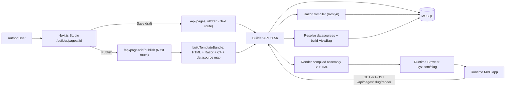
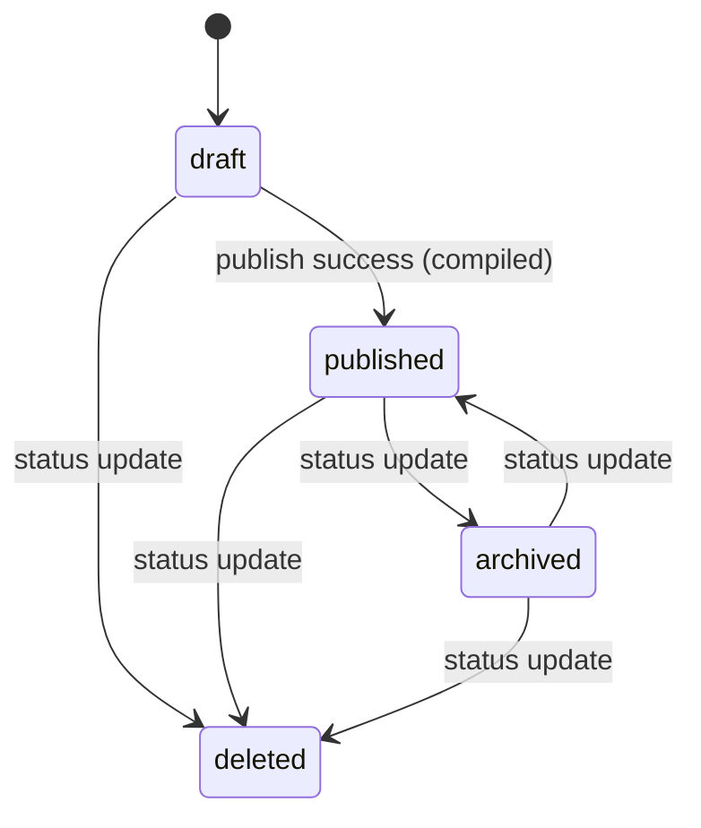

# Datasource & Dynamic Tables Feature

## What was asked

1. **Dynamic tables with relations** — users can create custom tables with typed columns and define 1:1, 1:N, N:N relations between them
2. **Tables as datasources in the page editor** — each page can configure named datasources (single record, list) with filters; components can bind their text fields to datasource fields via `{DS:source.field}` markers
3. **Publish → Razor artifact + compiled binary** — on publish, placeholders transform to `@ViewBag` syntax (CSHTML stored in DB), and a C# renderer class is compiled with Roslyn to assembly bytes (also stored in DB), plus a datasource map JSON
4. **Runtime render controller** — `GET/POST /api/pages/{id}/render` resolves datasource queries, populates a ViewBag dictionary, loads the compiled assembly, and returns rendered HTML

---

## Technical Architecture Flow (Current)

### Deployment topology

- **Authoring app (Next.js, port 3000)**: Puck editor, page manager, table manager, CSHTML viewer
- **Builder API (ASP.NET Minimal API, port 5056)**: source of truth for pages, compile/render engine, tables, media, runtime form handling
- **Runtime host (ASP.NET MVC app)**: catch-all `/{*slug}` route that proxies to Builder API render endpoint
- **Data stores**:
  - MSSQL local/prod for pages, datasources, rows, submissions, media metadata
  - Filesystem for media binaries

### End-to-end architecture flow



### Publish/compile flow (authoring path)

1. User edits in Puck (`/builder/pages/{pageId}`).
2. Next route `/api/pages/{pageId}/publish` generates a `TemplateBundle`:
   - datasource map JSON
   - intermediate Razor template (CSHTML artifact)
   - generated C# renderer source
3. Next route sends publish payload to Builder API `POST /api/pages/{id}/publish`.
4. Builder API compiles generated C# using Roslyn.
5. On success, API persists:
   - `PublishedJson`
   - `RazorTemplate`
   - `CompiledAssemblyBytes`
   - `DataSourceMapJson`
   - `IsCompiled = true`, `Status = published`
6. On compile failure, API returns error details and does **not** advance page to published/compiled state.

### Page lifecycle flow

- Supported statuses: `draft`, `published`, `archived`, `deleted`
- Updated via: `PATCH /api/pages/{id}/status`
- Guardrail: setting `published` is blocked when `IsCompiled == false`
- Runtime render gate:
  - requires compiled assembly
  - allows only renderable statuses (`published`, `archived`)



### Runtime render flow (`/api/pages/{id}/render`)

1. Request arrives either directly to Builder API, or via Runtime MVC catch-all slug route.
2. API validates page exists, compiled assembly exists, and status is renderable.
3. API reads datasource map and resolves datasource queries (supports query/body runtime filter inputs).
4. API builds `ViewBag` dictionary from datasource results.
5. API executes compiled renderer assembly with `ViewBag` and returns HTML response.

### Runtime form flow (`/api/forms/runtime-submit`)

1. Rendered form posts to first-party endpoint with hidden identifiers:
   - `_pbPageId`, `_pbPageSlug`, `_pbFormId`, `_pbFormTitle`
2. API finds form definition on page JSON and validates context.
3. API persists dynamic JSON submission payload.
4. If form sink mapping exists, API writes mapped values to linked datasource table row.
5. If relay URL exists, API relays request server-to-server and records relay status.
6. API returns user-facing success HTML response.

### Media flow (filesystem-backed)

1. Builder uploads media via `POST /api/media/upload`.
2. Binary stored on filesystem (`MediaRoot/...`), metadata stored in DB (`MediaAssets`).
3. Components reference media by asset id.
4. Runtime serves asset through first-party URL: `GET /media/{id}`.

---

## Placeholder DSL (Documented, Pending Implementation)

This section documents the approved placeholder syntax to be implemented later.

### 1) Single datasource placeholder

Use:

```text
name.propertyName
```

Meaning:
- `name` is the datasource key
- `propertyName` is the field to render from the single record object

### 2) List datasource placeholder (lambda predicate)

Use:

```text
name.predicate(x => <condition>).propertyName
```

Meaning:
- `name` is the datasource key
- `predicate(...)` accepts a lambda expression
- Runtime selects the **first** record that matches the predicate
- `propertyName` is read from that first matched record

### 3) Null/empty behavior

If datasource, match, or property is missing, renderer should return an empty string (safe fallback, no throw).

### 4) Razor/ViewBag mapping intent

The DSL remains author-facing syntax in content/templates, and publish/render conversion should inject values from `ViewBag` at runtime using the above evaluation semantics.

### 5) Merge tag pipe operators (documented first)

Pipes are supported on datasource merge tags and are evaluated in the publish/render pipeline.

Syntax:

```text
{{source.field | pipeA | pipeB:arg1:arg2}}
{{source[index].field | pipeA | pipeB:arg1}}
```

The datasource name must match the configured source name exactly (no singular/plural rewrite).

Initial supported pipes:

- `trim`
- `upper`
- `lower`
- `date:<format>` (example format: `yyyy-MM-dd`)
- `truncate:<length>[:suffix]`
- `default:<value>`
- `json`

Examples:

```text
{{product.title | trim}}
{{products[index].title | upper}}
{{product.createdAt | date:yyyy-MM-dd}}
{{product.description | truncate:120:...}}
{{product.subtitle | default:NA}}
{{product | json}}
```

Safe fallback:

- unknown pipes are ignored
- invalid args do not throw; value falls back to current string value
- missing datasource/property resolves to empty string as before

---

## Datasource Runtime Inputs (Implemented)

Display datasource filters now support dynamic input values from request query/body during runtime render.

### Filter config

Each filter can now define:

- `valueSource`: `static` | `query` | `body`
- `value`: static literal value
- `valueKey`: key used when source is `query` or `body`
- `required`: `true`/`false`
- `nullMode`: `skip-filter` | `empty-string` | `match-null`

### Runtime behavior

`/api/pages/{id}/render` accepts both:

- `GET` with querystring inputs
- `POST` with JSON/form body inputs (search payload)

When a dynamic input is missing:

- `required=true`: datasource is short-circuited (returns no rows)
- `required=false` + `nullMode=skip-filter`: ignore the filter
- `required=false` + `nullMode=empty-string`: apply filter with empty string
- `required=false` + `nullMode=match-null`: match null/empty row values (`neq` inverts this)

This allows datasources to be configured as optional or mandatory request-driven queries without forcing one global behavior.

---

## Saved Section Datasource Namespacing + Query Budget (Documented, Pending Implementation)

### 1) Saved section metadata persistence

If a section is saved to library and it has datasource configuration, the saved snapshot must keep that datasource metadata (definition + bindings), so the section can be reused with its data behavior intact.

### 2) Section-scoped ViewBag naming convention

Section-level datasource bindings should resolve under:

```text
ViewBag.<sectionNameSanitized>_<dataSourceNameSanitized>
```

Access intent:

- single source: `@ViewBag.<section>_<source>["property"]`
- list source: `@ViewBag.<section>_<source>[index]["property"]`

### 3) Sanitization rules for ViewBag-safe names

For both section name and datasource name:

- spaces and unsupported chars => `_`
- collapse repeated `_`
- trim leading/trailing `_`
- if identifier starts with a digit, prefix `_`
- if empty after sanitize, fallback to `section` / `source`

### 4) Smart aliasing (opt-in only)

If a section datasource and a page datasource are semantically identical, aliasing may reuse the same query result, but **only when user opt-in is enabled**.

Without opt-in aliasing, queries remain isolated even if equivalent.

### 5) Editor performance diagnostics

Builder should show estimated datasource query pressure for current page with color coding:

- green: low load
- amber: moderate load
- red: **more than 15 queries**

The diagnostics panel should make potential DB pressure visible before publish.

### 6) DSL/perf planner requirement

Planner should fingerprint datasource definitions (table, filters, sort/order, query type, limit, etc.) and dedupe only through opt-in aliasing.

Even when aliased, section-level ViewBag keys must still follow section namespace naming, and map to the aliased result safely.

### 7) Example namespace outputs

```text
Section: "Hero Banner", Source: "Product Feed"
=> ViewBag.Hero_Banner_Product_Feed

Section: "123 Promo", Source: "main-items"
=> ViewBag._123_Promo_main_items
```

---

## Conditional Block (Implemented)

Implemented as `ConditionalSwitch` in the Puck editor and publish pipeline.

### 1) Activation gate

The condition builder UI activates only when at least one datasource is configured on the page.
If none are configured, the field shows a guidance state and does not allow rule setup.

### 2) Query requirement

Condition logic is generated through a structured builder (source/field/operator/value) and emitted as a lambda-style expression:

```text
x => x.Field == "Value"
```

### 3) Runtime behavior

- Publish HTML includes markers: `{DS_IF:source|predicate}...{DS_ELSE}...{DS_ENDIF}`
- Generated C# renderer evaluates predicate against datasource rows at runtime
- Renders `if` branch when true, `else` branch when false
- Missing/invalid source or predicate fails safely (no throw), resulting in false branch or empty fallback

---

## Runtime Form Handler (Implemented First Pass)

Rendered forms must submit through our server first. This applies to the ASP.NET render page flow, not only the Puck editor preview.

### 1) Server-owned submit endpoint

Rendered forms should always post to a first-party handler, for example:

```text
POST /api/forms/runtime-submit
```

The browser should not post directly to the configured external `actionUrl`.

Each rendered form must include hidden identifiers:

- `_pbPageId`
- `_pbPageSlug`
- `_pbFormId`
- `_pbFormTitle`
- optional `_pbRenderVersion` or publish timestamp when available

These identifiers let the backend recognize which rendered page and form block produced the submission.

### 2) Form datasource writeback

A form can attach to **one datasource** as its data sink.

Form-level metadata:

```ts
type FormDataSink = {
  source: string;
  tableId: string;
  fieldMappings: Array<{
    formField: string;
    tableColumn: string;
  }>;
};
```

Submit behavior:

- Validate and normalize submitted field names
- Build a row object using explicit mappings
- If no explicit mapping exists for a field, optionally map by matching `formField.name` to table column name
- Insert a new `DynamicRows` row for the attached datasource table
- Store the raw submission record separately for audit/debugging
- File uploads are recorded as metadata in the raw submission payload; binary file storage is still a future step.

Update/edit behavior is not part of the first pass unless a future form includes an explicit row id and update mode.

### 3) External action relay

If `actionUrl` is configured, our server handler should process local handling first, then relay the payload.

Planned metadata:

```ts
type FormRelay = {
  actionUrl: string;
  method: "post" | "get";
};
```

Relay behavior:

- Validate `actionUrl` before use
- For `post`, forward normalized form data as a server-side request
- For `get`, append normalized form data as query params
- Record relay status with the submission
- Browser still receives our success/failure response, not a direct third-party response

### 4) Select datasource options

A `select` field can attach to **one datasource** as its option source.

Planned field-level metadata:

```ts
type SelectOptionSource = {
  source: string;
  tableId: string;
  valueField: string;
  labelField: string;
  orderBy?: string;
  orderDir?: "asc" | "desc";
};
```

Render behavior:

- If no datasource option source is configured, use the existing static `options` text
- If a datasource option source is configured, render options from datasource rows
- Option values come from `valueField`
- Visible labels come from `labelField`

### 5) Cascading datasource selects

Cascading selects are handled as parent-child field dependencies. A child select filters its datasource options using the selected value from a parent select.

Example:

```text
Country select -> State select -> City select
```

Planned metadata extends `SelectOptionSource`:

```ts
type SelectOptionSource = {
  source: string;
  tableId: string;
  valueField: string;
  labelField: string;
  orderBy?: string;
  orderDir?: "asc" | "desc";
  cascade?: {
    parentField: string;
    parentValueColumn: string;
  };
};
```

Meaning:

- `parentField` is the form field name to watch
- `parentValueColumn` is the column in this select's datasource table that must match the parent selected value

Runtime behavior:

- Top-level datasource selects can be rendered server-side with initial options
- Cascaded child selects render disabled until parent has a value
- A small runtime script watches parent selects and fetches child options from a first-party endpoint
- When a parent changes, all dependent child selects are cleared and reloaded
- Cascades can chain across more than two levels by repeating the parent-child rule

Planned endpoint:

```text
GET /api/forms/options?pageId=...&formId=...&fieldName=...&parentValue=...
```

The endpoint should resolve the published form metadata, validate that the requested field has an allowed datasource option source, apply the cascade filter, and return safe `{ value, label }` options.

---

## Filesystem-Based Media Management (Planned, Approved Direction)

Goal: use a first-party, filesystem-based media system so behavior is the same in local and production.

### Why this direction

- No third-party DAM dependency
- Local and production workflows stay identical
- Full control over metadata, URL shape, and publish behavior

### Scope

- Single media library UI integrated in builder
- Files stored on server filesystem (configurable root path)
- Metadata stored in DB for fast search/filter and usage tracking
- Publish/render use same media URLs and transformation pipeline

### Storage layout (proposed)

```text
{MediaRoot}/
  originals/{yyyy}/{MM}/{assetId}_{safeFileName}
  variants/{assetId}/{preset}.{ext}
  temp/{upload-session}/...
```

`MediaRoot` will come from config (`appsettings.*.json`) so local and prod can point to different absolute paths while using identical logic.

### Data model (proposed)

`MediaAsset`
- `Id (guid)`
- `OriginalFileName`
- `StoredFileName`
- `RelativePath`
- `MimeType`
- `SizeBytes`
- `Width`, `Height` (nullable)
- `HashSha256`
- `AltText`, `Caption`, `TagsJson`
- `CreatedAt`, `UpdatedAt`

`MediaUsage`
- `Id (guid)`
- `AssetId (guid)`
- `PageId`
- `ComponentType`
- `ComponentPath`
- `FieldName`
- `LastSeenAt`

### API plan (ASP.NET)

- `POST /api/media/upload` — upload one or many files
- `GET /api/media` — list/search assets (paging, filters)
- `GET /api/media/{id}` — asset detail
- `PATCH /api/media/{id}` — update metadata (`alt`, `caption`, `tags`)
- `DELETE /api/media/{id}` — delete asset (blocked if in-use unless force)
- `GET /media/{id}` — serve original (or redirect)
- `GET /media/{id}/{preset}` — serve generated variant (`thumb`, `card`, `hero`, etc.)

### Builder integration plan

- Add Media Library modal in editor:
  - upload
  - search
  - folder/tag filters (folders optional in phase 2)
  - select/replace image
- Image-capable components store `assetId` instead of raw external URL
- Add image field helper: resolves `assetId -> media URL` for preview and export

### Publish/render integration plan

- Published HTML should use stable first-party media URLs:
  - `/media/{id}` or `/media/{id}/{preset}`
- Render endpoint keeps existing output path; only image URL generation changes
- Exported HTML can include absolute URLs using configured public origin

### Security and reliability plan

- Allow-list MIME types and max file size
- Virus scan hook point (optional adapter)
- Safe file names + path traversal protection
- Strong cache headers + ETag for media responses
- Background variant generation + on-demand fallback
- Dedup support using `HashSha256` (phase 2)

### Rollout phases

1. **Phase 1 (MVP):** upload/list/select/delete, DB metadata, serve originals
2. **Phase 2:** responsive variants + presets + metadata edit (`alt/caption/tags`)
3. **Phase 3:** usage tracking, safe delete checks, where-used panel
4. **Phase 4:** folder organization, bulk actions, dedup, replace-with-version

### Non-goals for phase 1

- Cloud object storage
- External DAM connectors
- AI tagging or OCR

---

## Backend (api/Builder.Api/)

- **New models:** `TableDefinition`, `TableRelation`, `DynamicRow`, `DynamicRelationRow`
- **Updated Page model:** Added `DataSourceMapJson`, `RazorTemplate`, `CompiledAssemblyBytes` columns
- **DbContext:** `BuilderDbContext.cs` — 7 DbSets, EF Core mappings
- **RazorCompiler service:** `Services/RazorCompiler.cs` — uses Roslyn `CSharpCompilation` to compile C# renderer to assembly bytes
- **NuGet:** `Microsoft.CodeAnalysis.CSharp 5.0.0` (must be 5.x to match EF Core Design 10.x dependency on Roslyn 5)
- **Program.cs:** Full CRUD for tables, rows, relations; publish endpoint compiles renderer; `/api/pages/{id}/render` resolves datasources and invokes compiled assembly
- **Schema migration:** `EnsureCreatedAsync()` + inline `IF NOT EXISTS` CREATE TABLE / ALTER TABLE for both new tables and new Page columns (no EF migrations used)

### Schema bootstrap order (Program.cs)

1. `EnsureCreatedAsync()` — creates full schema for fresh DBs
2. ALTER TABLE Pages — adds `DataSourceMapJson`, `RazorTemplate`, `CompiledAssemblyBytes` if missing
3. CREATE TABLE `TableDefinitions` if not exists
4. CREATE TABLE `TableRelations` if not exists (FK cascade to TableDefinitions)
5. CREATE TABLE `DynamicRows` if not exists (FK cascade to TableDefinitions)
6. CREATE TABLE `DynamicRelationRows` if not exists (FK cascade to TableRelations)

---

## Frontend (src/)

- **`lib/tables-api.ts`:** Server-only API client for table/row/relation CRUD
- **`lib/datasource-template.ts`:** Generates `{DS:source.field}` and `{DS_LIST_START:x}...{DS_LIST_END}` markers in HTML, CSHTML template, and C# renderer source
- **`lib/builder-api.ts`:** Updated `publishApiPage` to accept and forward `TemplateBundle`
- **`lib/page-store.ts`:** Updated `publishPage` to accept optional `TemplateBundle`
- **API routes:** `/api/tables/**` proxy routes (tables, rows, relations)
- **Updated publish route:** Calls `buildTemplateBundle()` before publishing to generate Razor + C# source
- **UI pages:** `/tables` (manager), `/tables/[tableId]` (schema designer), `/tables/[tableId]/data` (row editor)
- **Components:** `TableDesigner.tsx`, `TableDataEditor.tsx`, `DataSourcePanel.tsx` (DataSourceManager + DsBindingsEditor)
- **Puck config:** Added `dataSources` field to root, `_dsBindings` field to Hero/Heading/FeatureCard/Callout, new `DynamicList` component for list iteration
- **Dashboard:** Added Tables link and Render button (points to ASP.NET render endpoint)

---

## Key design decisions

- Template generation is a two-path system: `export-html.tsx` for static export, `datasource-template.ts` for datasource-aware publish
- C# renderer uses Base64-encoded HTML template + regex replacement at runtime (avoids string escaping, handles both single-record and list bindings)
- CSHTML template stored as human-readable artifact; compiled assembly bytes for actual runtime rendering
- `usePuck().appState.data.root.props.dataSources` is how the DsBindingsEditor reads page-level datasources in the Puck editor context

---

## Bugs fixed during implementation

| Bug | Fix |
|-----|-----|
| `RouteContext` typed params error on new API routes | Used `{ params: Promise<{ tableId: string }> }` pattern instead |
| `TableDataEditor` inputType TS error | Used `const typeMap: Record<string, string>` with explicit type |
| `usePuck()` wrong property (`state` vs `appState`) | Changed to `const { appState } = usePuck()` (Puck v0.21 API) |
| Roslyn version conflict with EF Core 10 | Upgraded `Microsoft.CodeAnalysis.CSharp` from 4.14.0 → 5.0.0 |
| `Invalid object name 'TableDefinitions'` on existing DB | Added inline `IF NOT EXISTS CREATE TABLE` SQL for all 4 new tables in schema bootstrap |

---

## Outstanding issue

**`usePuck` Turbopack build error** — `config.tsx` imports `usePuck` from `@puckeditor/core`, but `config.tsx` is also imported by the server component `src/app/p/[pageId]/page.tsx`. Turbopack resolves `@puckeditor/core` using the `react-server` export condition for server-component import chains, which maps to `rsc.mjs` — and that bundle does not export `usePuck`.

**Error message:**
```
./src/puck/config.tsx:1:1
Export usePuck doesn't exist in target module
```

**Root cause:** `config.tsx` has no `"use client"` directive, so when imported from a server page, Turbopack uses the RSC variant of `@puckeditor/core`.

**Planned fix:**
1. Remove `usePuck` from the import in `config.tsx`
2. Extract the render function inside `dsBindingsField()` (lines 314–335 of `config.tsx`) into a new `"use client"` file (e.g. `src/puck/DsBindingsFieldRenderer.tsx`) that imports `usePuck` there
3. Have `config.tsx` import and use that component — since `config.tsx` itself no longer directly imports `usePuck`, Turbopack won't try to find it in the RSC bundle

The dev server (`next dev`) works fine; only `next build` triggers the error.
